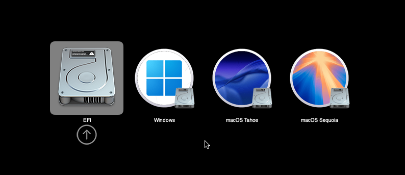
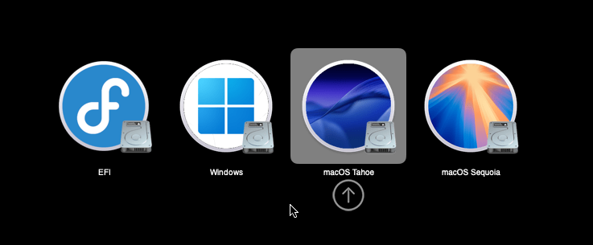
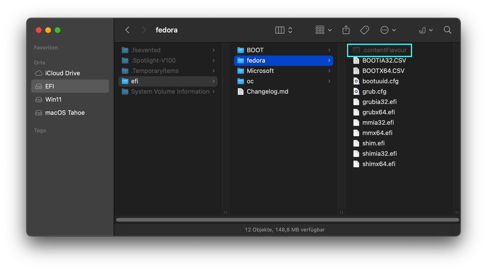
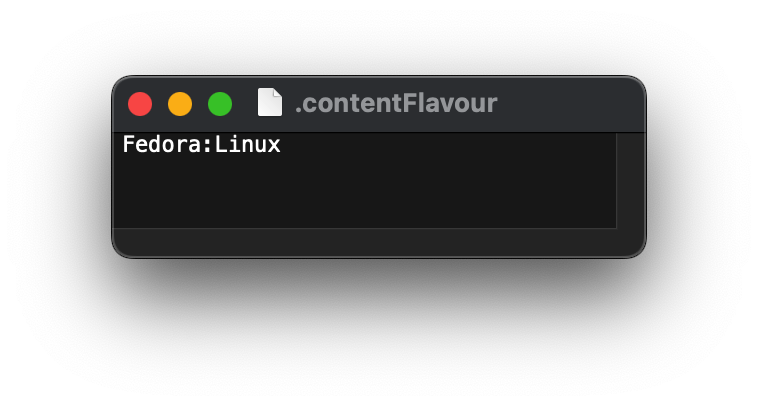

# Making OpenCanopy display a proper icon for your Linux install

## About
By default, you will mostl likely see a generic HDD icon in OpenCore's Bootpicker after installing Linux:

We will fix this, so that it displays the proper icon for the installed distro – in this case, **Fedora**:

## Instructions

- Mount the EFI Sysptem Partiton with OCAT
- Navigate to `EFI/OC`
- On your Keyboard, press <kbd>CMD</kbd><kbd>SHIFT</kbd><kbd>.</kbd> to gether to show hidden files
- Copy the `.contentFlavour` file
- Paste it into the directory containling the bootloader files for your Linux distro. In my case, it's the "fedora" folder:  
- Right-click the file and open it with Textedit
- Enter the name of the distro or better yet the name of the icon to represent it, followed by the type of OS it is (in this example it's Fedora which is a Linux OS): 
- Save the file
- Reboot and enjoy

## Supported Linux Icons
Since my `config.plist` is already set-up to make use of content flavour files, all you need to do is to make sure that the icon for the distro you want to use exists in: `/EFI/OC/Resources/Image/HJebbour/GoldenGateExt` and is referenced correctly by name in the `.contentFlavour` file. 

Currently, the GoldenGateExt contains icons for about 30 individual con for Linux distributions (and Linux-based operating systems):

* Arch Linux (`Arch.icns`)
* CachyOS (`CachyOS.icns`)
* CentOS (`CentOS.icns`)
* Debian (`Debian.icns`)
* Deepin (`Deepin.icns`)
* elementary OS (`elementaryOS.icns`)
* EndeavourOS (`EndeavourOS.icns`)
* Endless OS (`Endless.icns`)
* Fedora (`Fedora.icns`)
* Generic Linux (`Linux.icns`)
* Generic external Linux (`ExtLinux.icns`)
* Gentoo (`Gentoo.icns`)
* Kali Linux (`Kali.icns`)
* KDE neon (`KDEneon.icns`)
* Kubuntu (`Kubuntu.icns`)
* Lubuntu (`Lubuntu.icns`)
* Mageia (`Mageia.icns`)
* Manjaro (`Manjaro.icns`)
* Linux Mint (`Mint.icns`)
* MX Linux (`MX.icns`)
* openSUSE (`openSUSE.icns`)
* Pop!_OS (`PopOS.icns`)
* Rocky Linux (`Rocky.icns`)
* Red Hat Enterprise Linux (`RHEL.icns`)
* Solus (`Solus.icns`)
* Ubuntu (`Ubuntu.icns`)
* Ubuntu Cinnamon (`UbuntuCinnamon.icns`)
* Ubuntu DDE (`UbuntuDDE.icns`)
* Ubuntu Kylin (`UbuntuKylin.icns`)
* Ubuntu MATE (`UbuntuMATE.icns`)
* Void Linux (`Void.icns`)
* Xubuntu (`Xubuntu.icns`)
* Zorin OS (`Zorin.icns`)

If a specific Icon does not exist, you need to either create your own (don't ask me!) or choose a similar icon. I am actually running Aurora OS which is based on Fedora, but  since the theme doesn't contain one for Aurora, I am using the Fedora icon.